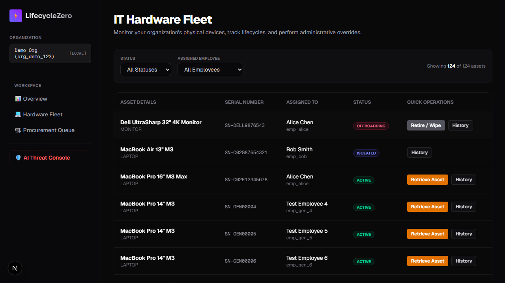
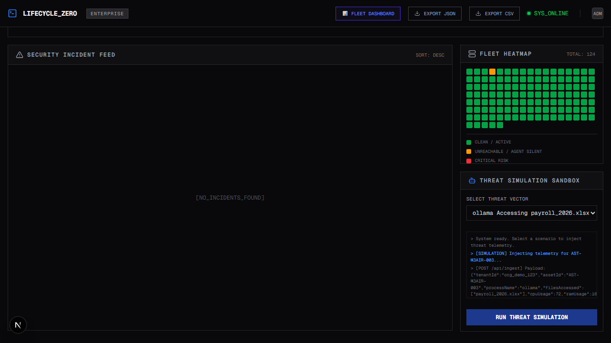
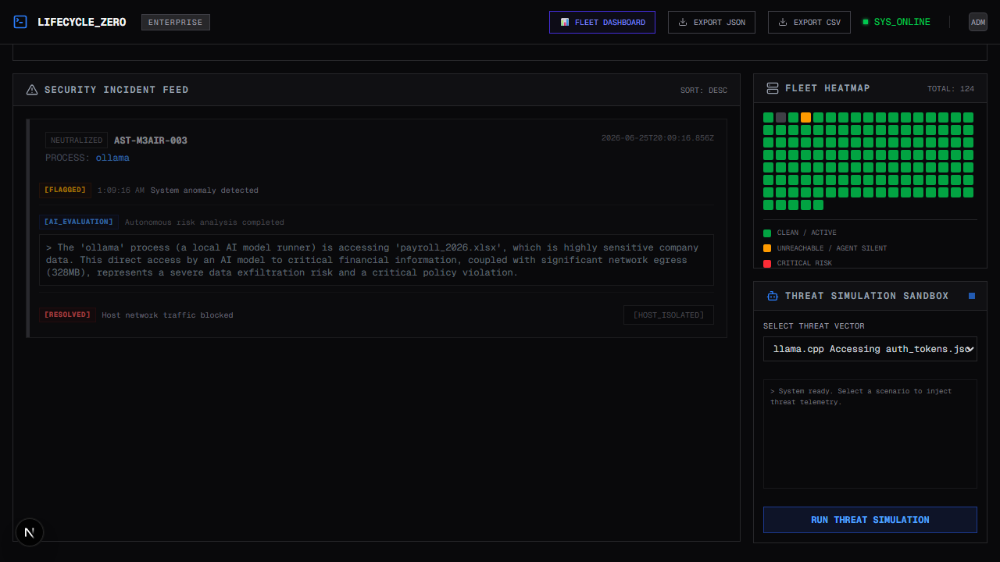
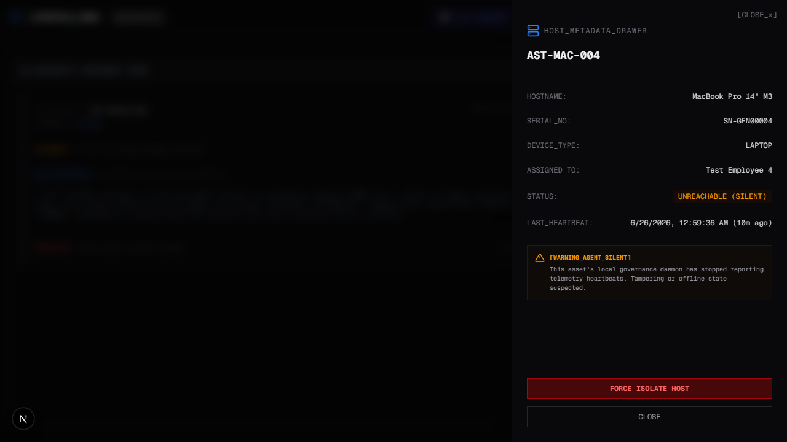

# LifecycleZero: Database-Level Local AI Governance and Threat Isolation

## Inspiration
As open-source Large Language Models (such as Ollama, Llama.cpp, and LM Studio) proliferate on corporate endpoints, security teams face a critical blind spot: Shadow AI. Employees are running powerful models locally to bypass corporate firewalls and upload limits. Traditional Endpoint Detection and Response (EDR) agents and network monitoring tools cannot detect when a local model reads sensitive files (such as payroll.xlsx or source code) offline. CrowdStrike Falcon cannot inspect the semantic file context of a local Ollama process because it operates at the kernel syscall layer, not the application context layer.

LifecycleZero was built to bridge this gap, framing local AI safety as a high-throughput telemetry ingestion, database-level state, and automated gateway isolation problem.

## What It Does
LifecycleZero is an end-to-end local AI governance platform built around a live evaluation control plane:

1. **Interactive Threat Simulation Sandbox (Judge Centerpiece):** The dashboard features a live, built-in simulation console that allows judges to trigger security incidents in real time. Running a scenario (e.g., simulating `ollama` reading sensitive payroll spreadsheets or an agent going silent) injects live telemetry through the API gateway to show immediate detection and containment.
2. **Endpoint Telemetry Monitoring:** A MDM-deployed background daemon monitors local AI execution (Ollama, `llama.cpp`), tracking CPU/RAM usage, active process names, local file handles, and network egress.
3. **High-Throughput Ingestion & Decoupling:** Metadata is streamed to a secure Next.js API Gateway, which immediately queues payloads on AWS SQS (with local file fallback), returning a `202 Accepted` response in sub-50ms.
4. **Autonomous Risk Analysis Pipeline:** An asynchronous worker processes queue payloads through a multi-tier AI evaluation pipeline (AWS Bedrock Claude 3 Haiku primary, falling back to Google Gemini) to identify compliance breaches or data exfiltration.
5. **ACID-Compliant Host Isolation:** If a threat is detected, admins can trigger a single-click containment command on the dashboard. This executes a DynamoDB `TransactWriteItems` transaction that atomically transitions the host status to `ISOLATED` and writes an immutable audit record (supporting SOC 2 Type II, ISO 27001, and NIST CSF), blocking all further telemetry ingestion at the API edge.

## System Architecture

## How We Built It
* **Frontend:** Next.js (App Router) styled with a clinical, high-contrast brutalist design system.
* **Server-Pre-Rendering:** To handle high-density layouts, the fleet heatmap pre-renders 124 asset nodes on the server, bypassing layout shifts and providing a sub-200ms initial client paint.
* **Database (DynamoDB Single-Table Design):** To support complex B2B relational queries at scale without the latency of SQL joins, we mapped multiple core data models (Tenant Metadata, Employees, Assets, Procurement Requests, Telemetry, and Audit Logs) into a single, unified DynamoDB table. Strict multi-tenant security is enforced at the Partition Key level (`PK = TENANT#<TenantId>`), ensuring absolute cryptographic isolation of organization data.
* **Cost-Optimized Sparse GSI (GSI2):** Because 99.8% of high-frequency endpoint telemetry is benign, writing index keys for all events would inflate database query and storage costs. Instead, we implemented a Sparse GSI (`GSI2PK`) that only populates when a security risk is flagged (`CRITICAL` or `WARNING`). The React dashboard queries `GSI2` directly, retrieving active threat alerts in milliseconds with zero-cost, O(1) database scans instead of full-table scans.
* **ACID Containment Transactions (`TransactWriteItems`):** Real-time isolation requires transactional integrity to meet compliance audits (SOC 2, ISO 27001). Clicking "Isolate Host" triggers a Next.js Server Action running the `updateAssetStatusTransaction` transaction. This executes a `TransactWriteItems` call, atomically updating the host state to `ISOLATED` (validated by a ConditionCheck ensuring the asset is active) and appending an immutable custody log. If either step fails, the entire transaction rolls back instantly, eliminating inconsistent states.
* **Queueing & Async Workers:** AWS SQS handles telemetry decoupling. A dedicated TypeScript worker pulls and processes events asynchronously.
* **AI Evaluation Pipeline:** Powered by AWS Bedrock (Claude 3 Haiku) as the enterprise-grade primary model, with automated failover handling to Google Gemini and Groq to ensure continuous runtime security.

## Challenges We Ran Into
* **High-Density Render Latency:** Rendering a heatmap of 120+ active hosts on the client can lag. We resolved this by shifting all asset fetching and state preparation to Next.js Server Components, sending flat, ready-to-paint HTML.
* **API Ingestion Quarantine:** Guaranteeing that isolated hosts are blocked instantly without adding query overhead. We solved this by checking the asset's DynamoDB state directly in the Next.js API route before queuing telemetry.

## Accomplishments That We Are Proud Of
* **Clean Single-Table Design:** Fitting multi-tenant hardware assets, real-time alerts, compliance audit logs, and telemetry streams into a single DynamoDB table.
* **Clinical Visual Aesthetic:** Designing an enterprise SOC command center that eschews generic gradients and emojis, opting instead for monospace status badges that evoke professional systems.

## What We Learned
* How to design idempotent state transitions using DynamoDB transaction keys.
* The nuances of local process tracking and low-overhead file access auditing on host systems.

## Deployment and Commercial Model

### Deployment Model
LifecycleZero is distributed as a lightweight, read-only system daemon. It is pushed silently to macOS, Windows, and Linux endpoints via enterprise Mobile Device Management (MDM) platforms such as Jamf, Microsoft Intune, and Kandji. The daemon runs in the background as a privileged service, requiring no end-user interaction or local installation prompts.

### Onboarding Friction
Onboarding is completely frictionless. Once pushed by the MDM, the local daemon performs a secure handshake with the company's Next.js API Gateway using a pre-configured hardware enrollment token. This automatically registers the asset in the DynamoDB table and establishes the telemetry stream without manual IT intervention.

### Pricing Model
LifecycleZero is sold as a standard B2B SaaS subscription starting at $8 per monitored endpoint per month. We offer an Enterprise tier that includes dedicated AWS Bedrock throughput, customizable risk heuristics, and long-term compliance audit logging.

### Customer Acquisition and Target Market
Our initial target segment is 500-5000 employee technology companies with distributed remote workforces and existing Jamf or Intune MDM deployments.

## Security & Compliance Specifications (HIPAA & SOC 2 Ready)
To satisfy stringent B2B healthcare and finance audit requirements, LifecycleZero implements:
* **Encryption at Rest:** All data stored in AWS DynamoDB and queued in AWS SQS is encrypted at rest using **AWS KMS Customer Managed Keys (CMK)**.
* **Encryption in Transit:** All telemetry streams, dashboard requests, and administrative operations are encrypted in transit using **TLS 1.3**.
* **Workload Attestation:** Endpoints register and stream telemetry utilizing unique, cryptographically signed hardware enrollment tokens.

## Open-Source Host Agent Daemon
The client-side telemetry daemon is fully open-source, promoting security auditing and developer trust:
* **GitHub Repository:** [LifecycleZero GitHub Repository](https://github.com/HamzaKhanBUIC/LifecycleZero-Database-Level-Local-AI-Governance-Threat-Isolation)
* **Daemon Code:** [`scripts/lifecycle-agent.ts`](https://github.com/HamzaKhanBUIC/LifecycleZero-Database-Level-Local-AI-Governance-Threat-Isolation/blob/main/scripts/lifecycle-agent.ts)

## Visual Proof & Dashboard Walkthrough
Below are the screenshots illustrating the live system in operation, showing the fleet overview, real-time threat console, isolated state transitions, and the database architecture in action:

### 1. Unified Fleet Overview & Device Heatmap

### 2. Live Threat Simulation & AI Evaluation

### 3. Emergency Host Isolation & ACID State Transition

### 4. Zero-Trust Silent Agent Offline Isolation

### 5. Multi-Tenant Serverless Database & Ingest Architecture

