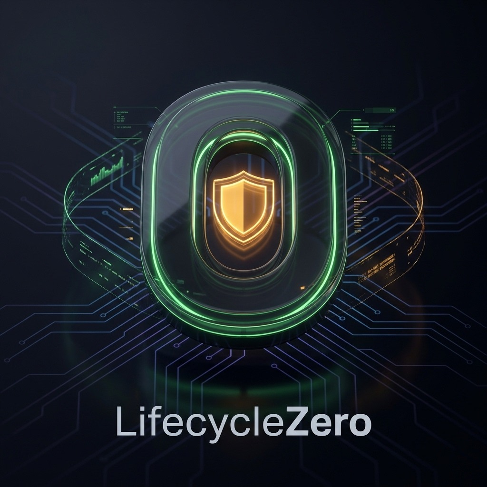
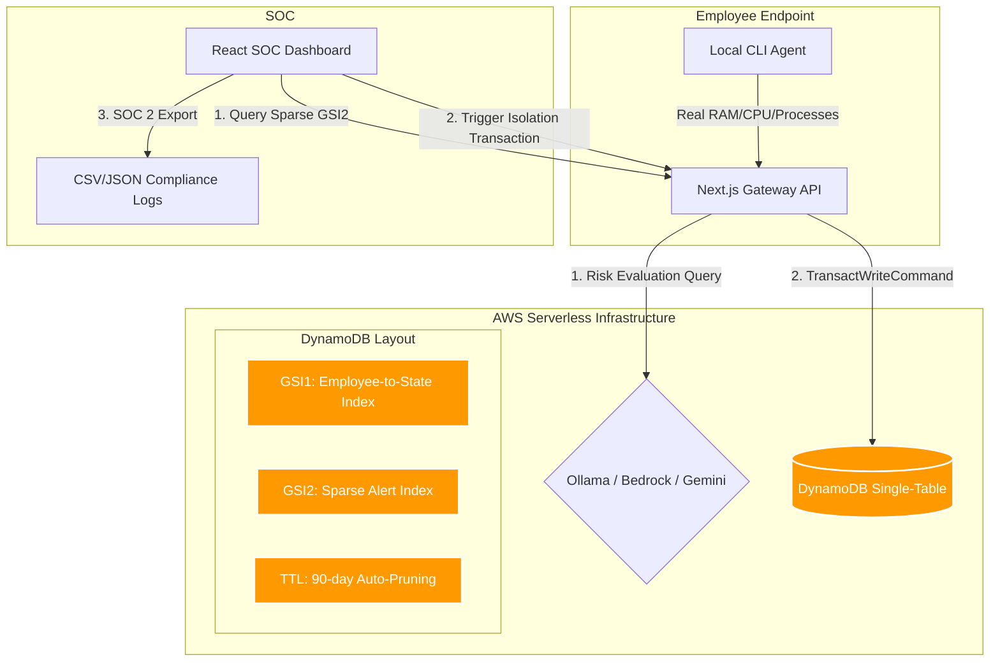
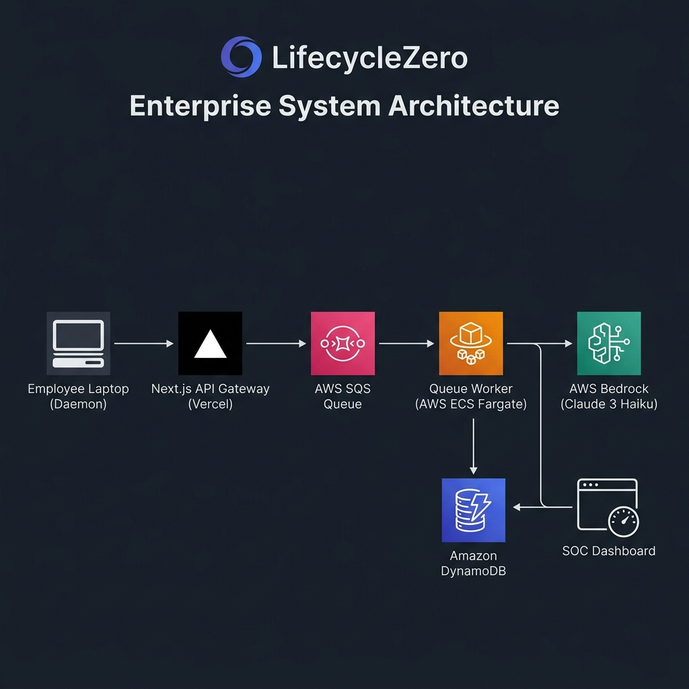
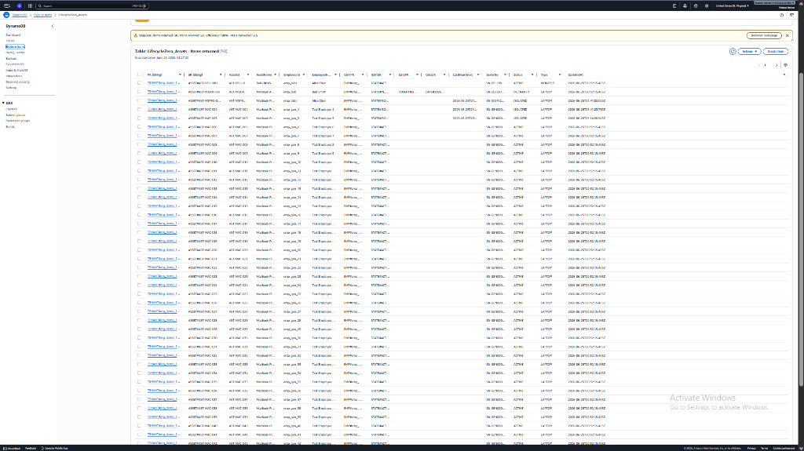

<p align="center">
  
</p>

# LifecycleZero: Database-Level Local AI Governance & Threat Isolation

LifecycleZero is an enterprise-grade security platform that frames local AI governance as a database-level security infrastructure problem.

## The Framing: Why This Matters

As local LLMs (like Ollama, Llama.cpp, and LM Studio) proliferate on corporate laptops, security teams face a massive blind spot. Employees are running open-source models locally to bypass corporate monitoring. Traditional endpoint protection (EDRs) and network firewalls are blind to this local context (e.g. which local model is reading which confidential file, and is it attempting network egress?). CrowdStrike Falcon cannot inspect the semantic file context of a local Ollama process because it operates at the kernel syscall layer, not the application context layer.

LifecycleZero solves this by treating local AI safety as a high-throughput telemetry ingestion and database isolation problem:
1. **Real-time Endpoint Telemetry Ingestion:** A lightweight endpoint daemon tracks local model activity (CPU, RAM, process names, files read, and network egress) and streams it to a secure gateway API.
2. **Autonomous AI Threat Evaluation:** Telemetry is analyzed by a fast, secure, multi-tier AI evaluation pipeline (using AWS Bedrock, Google Gemini, and Groq) to determine if a local LLM is acting maliciously.
3. **Database-Level Isolation Policy:** If a threat is detected, an administrator executes a single-click transaction that alters the asset's security state, writes an immutable audit log, and immediately blocks further telemetry ingestion at the API gateway level.

---

## Technical Architecture





### Live Amazon DynamoDB Single-Table Database Console


---

## Technical Highlights

AWS Database Architects and Solution Architects will appreciate the implementation details:

* **Single-Table DynamoDB Schema:** Enforces multi-tenant isolation at the Partition Key level (`PK = TENANT#<TenantId>`). Tenant A can never query or accidentally scan Tenant B's data.
* **Sparse Indexing (GSI2):** Only critical or warning telemetry events write to `GSI2PK`. This enables the SOC dashboard to fetch live alerts in milliseconds without performing expensive and slow table scans.
* **Telemetry Write Sharding [NEW]:** Distributes raw telemetry writes across 10 physical partitions (`TENANT#<TenantId>#TELEMETRY#SHARD#<0-9>`) to bypass Partition WCU thresholds.
* **Host-Specific Key Rotation [NEW]:** Heartbeats are secured using device-specific agent keys generated dynamically on first handshake.
* **Anti-Spoofing Verification [NEW]:** Gateway verifies hardware UUID signatures to prevent endpoint spoofing.
* **Operational Data Purging (TTL):** Telemetry records are tagged with an expiration epoch (90 days). DynamoDB automatically purges them, preventing storage bloat.
* **ACID Transactions (TransactWriteCommand):** Isolation commands atomically update the asset's status to `ISOLATED` and insert an immutable `AUDIT` log entry. The operation is fully atomic; it either completely succeeds or rolls back. Audit logs are structured to support SOC 2 Type II, ISO 27001, and NIST CSF reporting requirements.
* **Endpoint Ingestion Block:** The Ingestion API enforces network quarantine. If a laptop's asset record is `ISOLATED`, the API immediately rejects its telemetry with `403 Forbidden` (`FORBIDDEN_ISOLATED`).
* **Asynchronous Telemetry Queue (SQS):** Ingestion is built for scale. Telemetry is POSTed to the API gateway, instantly placed on an AWS SQS queue (with a filesystem queue fallback for local development), and returns `202 Accepted` in sub-50ms. A background worker script pulls events asynchronously to process them.
* **Resilient SDK Client:** Configured with `maxAttempts: 5` and exponential backoff. Explicitly handles `TransactionCanceledException` (extracting cancellation codes) and `ProvisionedThroughputExceededException`.

---

## Enterprise Deployment and Commercial Model

* **Master Playbook & Architecture Guide:** For a deep dive into schemas and configurations, review our **[Enterprise Architecture Playbook](docs/ARCHITECTURE_PLAYBOOK.md)**.
* **Deployment Model:** LifecycleZero deploys as a lightweight, read-only system daemon pushed silently to macOS, Windows, and Linux endpoints via Mobile Device Management (MDM) tools (e.g., Jamf, Microsoft Intune, Kandji). No end-user interaction or local installation prompts are required.
* **Onboarding Friction:** Zero. Once the MDM pushes the daemon, it automatically completes a secure handshake with the tenant's API gateway using a pre-configured hardware enrollment token, auto-provisioning its record in DynamoDB.
* **Pricing Model:** Standard B2B SaaS subscription starting at $8 per monitored endpoint per month. An Enterprise tier offers dedicated AWS Bedrock endpoints, custom security heuristic rules, and historical CSV audit logging.
* **Customer Acquisition & Target Market:** Our initial target segment is 500-5000 employee technology companies with distributed remote workforces and existing Jamf or Intune MDM deployments.

---

## Getting Started

### 1. Prerequisites
Ensure you have Docker running (for local DynamoDB) and Node.js installed.

### 2. Install Dependencies
```bash
npm install
```

### 3. Provision & Seed Local DynamoDB
Start the local DynamoDB container and seed the mock Acme Corp dataset (124 hardware assets):
```bash
# Start DynamoDB Local
npm run db:local

# In a new terminal, provision table & indices
npm run db:provision-local

# Seed the database
npm run db:seed-local
```

### 4. Run the Dev Server & Queue Worker
Start the Next.js development server and background queue worker:
```bash
# Terminal 1: Run dev server
npm run dev

# Terminal 2: Run queue worker
npm run worker
```
Open http://localhost:3000 to view the SOC dashboard. (Login using Clerk Test Credentials).

### 5. Launch the Local Endpoint Agent
Start the real endpoint agent on your local machine to begin streaming real CPU/RAM metrics:
```bash
npm run agent
```
*Tip:* The agent has a 15% chance to simulate a local threat process (e.g. `copilot-local` accessing `auth_tokens.json`). Watch the React dashboard and notice the real-time alert and live egress spike!

---

## SOC 2 Compliance Exports
* **JSON Export:** `/api/export/audit` (Auditor-friendly nested events)
* **CSV Export:** `/api/export/audit/csv` (Spreadsheet-ready compliance logs for upload into SIEMs)
