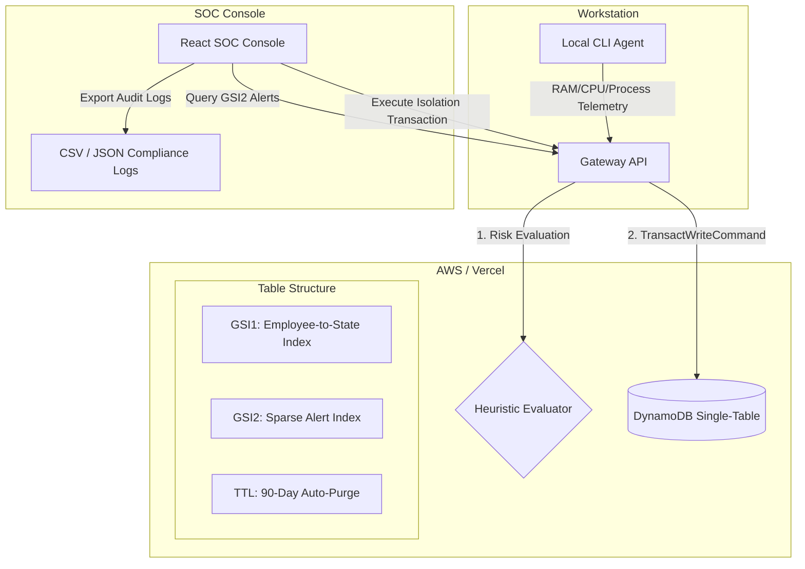

# LifecycleZero

> Database-level local AI endpoint telemetry governance and threat isolation engine with single-table Amazon DynamoDB architecture.

[](https://nextjs.org/)
[](https://aws.amazon.com/dynamodb/)
[](LICENSE)

---

## Overview

As local LLM engines (such as Ollama and Llama.cpp) run directly on developer workstations, security teams lack visibility into which local model processes are reading confidential files or initiating unapproved network egress.

**LifecycleZero** treats local AI governance as a high-throughput telemetry ingestion and database isolation problem:
1. **Endpoint Telemetry Streaming**: A lightweight agent monitors local model activity (CPU, RAM, process names, accessed paths, network sockets) and streams events to a Next.js gateway API.
2. **Threat Evaluation**: Telemetry is evaluated against offline heuristic signatures and local threat evaluation pipelines.
3. **Atomic Database Isolation**: When anomalous behavior is identified, an atomic DynamoDB transaction (`TransactWriteCommand`) transitions the asset state to `ISOLATED` and writes an immutable audit record, immediately blocking further ingestion at the API gateway.

---

## Architecture Flow


```mermaid
graph TD
    subgraph Endpoint [Workstation]
        Agent[Local CLI Agent] -->|RAM/CPU/Process Telemetry| API[Gateway API]
    end

    subgraph Serverless Backend [AWS / Vercel]
        API -->|1. Risk Evaluation| Eval{Heuristic Evaluator}
        API -->|2. TransactWriteCommand| DDB[(DynamoDB Single-Table)]
        
        subgraph Table Structure
            GSI1[GSI1: Employee-to-State Index]
            GSI2[GSI2: Sparse Alert Index]
            TTL[TTL: 90-Day Auto-Purge]
        end
    end

    subgraph Management [SOC Console]
        Dashboard[React SOC Console] -->|Query GSI2 Alerts| API
        Dashboard -->|Execute Isolation Transaction| API
        Dashboard -->|Export Audit Logs| CSV[CSV / JSON Compliance Logs]
    end
```

---

## Technical Specifications

- **Single-Table DynamoDB Design**: Multi-tenant isolation enforced at the partition key boundary (`PK = TENANT#<TenantId>`).
- **Sparse Alert Indexing (GSI2)**: Warning and critical alerts write to `GSI2PK`, allowing fast alert queries without full table scans.
- **Partition Write Sharding**: Ingestion writes are distributed across 10 physical partition shards (`TENANT#<TenantId>#TELEMETRY#SHARD#<0-9>`) to handle burst traffic.
- **Hardware Attestation**: Verifies hardware UUID signatures on incoming telemetry packets to prevent endpoint spoofing.
- **Atomic State Transitions**: Isolation operations use `TransactWriteCommand` to update asset status and commit audit log entries in a single atomic transaction.
- **Endpoint Gatekeeping**: Once marked `ISOLATED`, the ingestion gateway rejects incoming telemetry with `403 Forbidden` (`FORBIDDEN_ISOLATED`).
- **Automated Data Lifecycle**: Records include a 90-day epoch timestamp handled automatically by DynamoDB TTL.

---

## Repository Structure

```
.
├── src/
│   ├── app/                  # Next.js App Router and API routes
│   ├── components/           # SOC dashboard and fleet management UI
│   ├── lib/
│   │   ├── dynamodb.ts       # Single-table DynamoDB client and transactions
│   │   ├── telemetry.ts      # Telemetry ingestion and sharding logic
│   │   └── security.ts       # Hardware signature verification
│   └── agent/                # Local workstation telemetry collector
├── scripts/                  # Local DynamoDB provisioning and seed scripts
├── docker-compose.yml        # Local DynamoDB container setup
└── package.json
```

---

## Getting Started

### Prerequisites
- Node.js 18 or higher
- Docker (for local DynamoDB testing)

### Local Setup

1. **Install dependencies**:
   ```bash
   git clone https://github.com/HamzaKhanBUIC/LifecycleZero-Database-Level-Local-AI-Governance-Threat-Isolation.git
   cd LifecycleZero-Database-Level-Local-AI-Governance-Threat-Isolation
   npm install
   ```

2. **Provision and seed local DynamoDB**:
   ```bash
   # Start DynamoDB local container
   npm run db:local

   # Provision tables and indices
   npm run db:provision-local

   # Seed test dataset
   npm run db:seed-local
   ```

3. **Start dashboard and queue worker**:
   ```bash
   # Terminal 1: Next.js dev server
   npm run dev

   # Terminal 2: Queue worker
   npm run worker
   ```

4. **Run local telemetry agent**:
   ```bash
   npm run agent
   ```

---

## Compliance & Audit Exports

- **JSON Audit Stream**: `/api/export/audit` (Structured compliance events)
- **CSV Audit Log**: `/api/export/audit/csv` (Flat logs formatted for SIEM ingestion)

---

## License

This project is licensed under the MIT License. See [LICENSE](LICENSE) for details.
