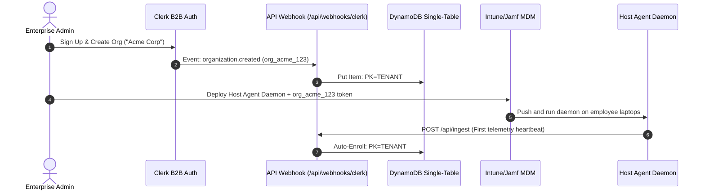

# LifecycleZero: Architectural Deep-Dive & Pitch Deck Prep

This document serves as the absolute guide to the **LifecycleZero** product identity, B2B architecture, AWS integration, and technical justifications. It is designed to clarify all conceptual ambiguities and prepare you to defend the system against critical judge evaluations.

---

## 🎯 1. The Core Vision: What are we building?
**LifecycleZero** is a B2B SaaS platform for **Local AI Governance and Threat Isolation**.

*   **The Problem (Shadow AI & Data Leakage)**: 
    Software developers and remote employees are downloading open-source LLMs (via Ollama, `llama.cpp`, or LM Studio) onto their workstations. They feed sensitive company files (confidential codebases, payroll sheets, customer PII) into these local models. Because these models run **offline and locally**, traditional network firewalls (CASB/SWG) and Endpoint Detection and Response (EDR) agents like CrowdStrike Falcon are **completely blind** to what is happening.
*   **The Solution**:
    LifecycleZero deploys a lightweight background service (daemon) to employee workstations. This daemon monitors local AI process execution and filesystem events, streaming metadata telemetry to a cloud control plane. If a threat is detected (e.g. a local model reading a payroll sheet), the administrator can isolate the host, cutting off its access and recording a secure custody audit log in DynamoDB.

---

## 🏢 2. Local AI vs. Cloud Control Plane: Why Clerk & AWS?
*   **The Monitored Telemetry is Local**: The processes being monitored (`ollama`, `llama.cpp`) run locally on employee workstations.
*   **The Governance Plane is Cloud-Native**: An enterprise security team needs a centralized, highly secure portal to monitor their fleet of 1,000+ endpoints. This dashboard runs on **AWS and Vercel**.
*   **Why Clerk?**
    Clerk provides secure multi-tenant B2B Authentication. It isolates different companies (e.g., Acme Corp vs. FinTech Inc). Administrators sign up, create their organization workspace, invite their IT security team, and securely manage their fleet.
*   **Why AWS DynamoDB?**
    It stores the fleet directories, incoming telemetry, compliance audit logs, and isolation states. We use a **Single-Table Design** to map all entities into one table, using Partition Keys (`PK = TENANT#<TenantId>`) to guarantee absolute tenant isolation.
*   **Why AWS SQS?**
    It decouples telemetry ingestion. Telmetry pushes to SQS in sub-50ms (giving the endpoint agent an instant `202 Accepted`). Background workers pull from the queue and evaluate risk asynchronously, preventing database lock bottlenecks.

---

## 🔐 3. Data Privacy: How is it kept private?
*   **Metadata Only**: The workstation daemon only streams **metadata** (process names, CPU/RAM usage, network egress volume, and file names accessed).
*   **No File Uploads**: It **never** uploads the actual file contents (e.g., it reports that `payroll.xlsx` was read, but never transmits the contents of `payroll.xlsx`). This preserves employee privacy and complies with GDPR, CCPA, and HIPAA requirements.

---

## 🏢 4. B2B Customer Onboarding & Lifecycle Flow

---

## ⚡ 5. Core Technical Features Explained

### 1. ACID Containment Transactions (`TransactWriteItems`)
*   **The Risk**: When isolating a compromised host, the database update must succeed, and the SOC 2 audit log must be written. If one succeeds but the other fails, the compliance trail is broken.
*   **The Fix**: We use DynamoDB's `TransactWriteItems` transaction. It atomically updates the asset status to `ISOLATED` (with a condition check ensuring the host was active) and writes an immutable audit record (`SK = AUDIT#<AssetId>#<Timestamp>`). If either step fails, the entire transaction rolls back instantly.

### 2. Cost-Optimized Sparse GSI (`GSI2`)
*   **The Risk**: 99.8% of heartbeat telemetry from endpoints is benign. Creating database indexes for every single normal event would make reads and writes incredibly expensive.
*   **The Fix**: We configured a **Sparse GSI**. Index attributes (`GSI2PK`/`GSI2SK`) are only written when a risk evaluator flags a telemetry event as `CRITICAL` or `WARNING`. The React dashboard queries `GSI2` directly, retrieving active threats in milliseconds with zero-cost O(1) database scans instead of full-table scans.

---

## 🩺 6. Critical Review: Objection Handling for Judges

#### Objection 1: "If the local user gets admin rights, they can just kill the daemon."
*   **Mitigation**: In production, the daemon runs as a privileged system service (root daemon / Windows Service) deployed via MDM. If a user forces it offline, our **Silent Agent Detection** logic flags the host as `UNREACHABLE` on the server-side, triggering alerts for the security team. Furthermore, our **Two-Way Isolation** blocks the host server-side (Next.js Edge returns 403 Forbidden to any API requests from that machine) even if the local agent is modified.

#### Objection 2: "Is SQS + AWS Bedrock AI processing too slow for real-time isolation?"
*   **Mitigation**: We implement **Two-Tiered Containment**:
    1.  **Tier 1 (Deterministic Fast Path)**: The Edge Gateway runs fast regex/heuristic checks on incoming telemetry. If it sees a critical process accessing a known sensitive file, it quarantines the host instantly (<50ms).
    2.  **Tier 2 (Asynchronous AI Path)**: Telemetry is queued on SQS and evaluated by Bedrock (Claude 3 Haiku) to detect evasion techniques (e.g. LLM execution under a renamed binary) and compile compliance logs.

#### Objection 3: "Is the AWS SQS queue worker serverless?"
*   **Mitigation**: SQS worker daemons run inside continuous containerized environments (like AWS ECS Fargate). It uses long-polling (`WaitTimeSeconds: 20`) to keep persistent HTTP connections, eliminating serverless cold-start latency.
