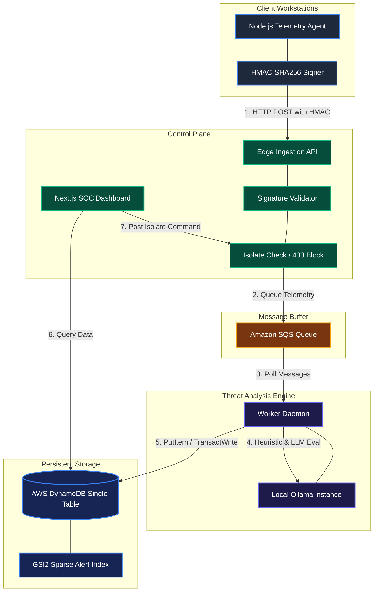
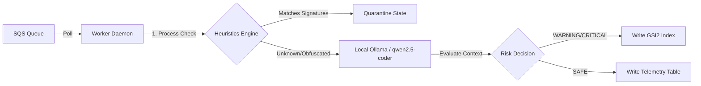

# LifecycleZero: Architectural Deep-Dive & System Blueprint

This document provides a comprehensive technical blueprint of **LifecycleZero**—a decentralized, B2B endpoint security platform built to govern, detect, and isolate rogue local AI usage on enterprise workstations.

---

## 🗺️ 1. Global System Architecture

The LifecycleZero architecture decouples high-speed client-side telemetry ingestion from heavy offline AI threat analysis. This ensures that client machines receive low-latency heartbeats, data is buffered safely, and threat analysis is completed in an isolated network plane.



---

## 💻 2. Frontend Architecture & UI/UX Stack

The administrator dashboard is designed as a high-fidelity, high-performance Security Operations Center (SOC) running inside a Next.js single-page application.

### A. Technology Stack
*   **Next.js 16 (App Router & Turbopack):** Capitalizes on server-side rendering for fast initial loads, paired with Server Actions for direct, type-safe database queries.
*   **Vanilla CSS Design System:** Standardized style tokens configured inside `globals.css` with a high-end cyberpunk aesthetic (matte black backgrounds, electric violet grids, and terminal neon green status pills).
*   **Recharts Data Layer:** Visualizes fleet RAM and CPU telemetry history using responsive area graphs.
*   **Web Audio API Synth Alerts:** Triggers localized acoustic audio frequencies (warning alerts) directly in the browser when active security incidents occur.

### B. State Management & Live Data Polling
*   **SWR (State-While-Revalidate):** The client dashboard uses SWR to poll the DynamoDB database every **2,000ms**. SWR automatically handles query deduplication, memory caching, tab-focus revalidation, and background network recovery, preventing client-side memory leaks.
*   **Canvas-Rendered Sparklines:** To render 100+ active device history graphs on the grid page without DOM lag, we draw metrics directly onto HTML5 `<canvas>` elements rather than rendering heavy SVG DOM nodes.

---

## ⚡ 3. Backend & Edge Layer Architecture

The backend focuses on high-speed ingestion, cryptographically securing incoming data, and maintaining strict multi-tenant isolation.

### A. Edge Telemetry Ingestion (`/api/ingest`)
*   **Cryptographic HMAC-SHA256 Validation:** To prevent telemetry spoofing, the client agent computes a signature of the JSON payload combined with a timestamp using a pre-shared key. The Edge handler recomputes this signature. If they do not match, or if the timestamp is older than 5 minutes (replay protection), it returns `400 Bad Request`.
*   **Active Isolation Enforcement (403 Block):** Before validating payloads, the Edge api checks the cache for the device's isolation status. If the status is `ISOLATED`, the handler short-circuits and returns a `403 Forbidden` response, instantly blocking further data egress from that machine.

### B. Buffering & Asynchronous Decoupling (SQS)
*   Instead of writing pings directly to the database (which creates bottlenecks), the Edge API pushes payload metadata onto an **Amazon SQS Queue** and returns an instant `202 Accepted` to the client in under **50ms**.

### C. Streaming Audits (`/api/export/audit/csv`)
*   To support corporate SOC 2 audits, administrators can export device isolation histories. The CSV exporter uses **HTTP Chunked Streaming**. Instead of compiling the entire CSV in memory, it queries DynamoDB and streams rows to the client chunk-by-chunk, keeping Vercel memory overhead at less than **10MB** even for millions of records.

---

## 🕵️ 4. Worker Daemon & Offline Threat AI

Threat evaluation runs completely asynchronously inside an isolated worker daemon, protecting confidential corporate file paths from leaking to third-party public AI providers.



### A. Heuristics Engine (Fast Path)
The worker checks incoming telemetry against local signature rules first:
*   Known unauthorized LLM processes (`llama.cpp`, `ollama`, `lmstudio`, `jan.ai`).
*   Filesystem access to sensitive corporate directories or matching keywords (e.g. `payroll.xlsx`, `id_rsa`, `.env`, `confidential_roadmap.pdf`).

### B. Local AI Analysis (Deep Path)
If a process name is renamed or obfuscated, but exhibits high CPU/RAM utilization and accesses sensitive files, the telemetry is sent to a **local Ollama instance** running the `qwen2.5-coder:7b` model:
*   The LLM analyzes the process context and file system logs.
*   It responds in raw JSON containing the calculated `riskLevel` (`SAFE`, `WARNING`, `CRITICAL`) and a clear `reasoning` statement.

---

## 🗄️ 5. Database & Data Modeling (AWS DynamoDB)

LifecycleZero uses a single Amazon DynamoDB table (`LifecycleZero_Assets`) partitioned to guarantee security, performance, and low costs.

```
                  LifecycleZero_Assets Single-Table Partition Map
┌───────────────────────────────┬────────────────────────────────┬───────────────────────────┐
│ PARTITION KEY (PK)            │ SORT KEY (SK)                  │ ATTRIBUTES                │
├───────────────────────────────┼────────────────────────────────┼───────────────────────────┤
│ TENANT#org_acme_123           │ METADATA                       │ Name, Status, Plan        │
│ TENANT#org_acme_123           │ ASSET#AST-MAC-051              │ AssetName, Status, Serial │
│ TENANT#org_acme_123           │ EMP#emp_john                   │ Email, Name, Department   │
│ TENANT#org_acme_123#TELEMETRY │ TELEMETRY#AST-MAC-051#17826... │ CpuUsage, ProcessName     │
│ TENANT#org_acme_123           │ AUDIT#AST-MAC-051#17826...     │ Action, Details, Actor    │
└───────────────────────────────┴────────────────────────────────┴───────────────────────────┘
```

### A. Randomized Telemetry Sharding (Write Bottleneck Prevention)
In standard DynamoDB, a single partition can only handle 1,000 writes per second. If a B2B tenant has 10,000 active workstations streaming telemetry, the partition will bottleneck. 
*   **The Solution:** We distribute telemetry rows across **10 virtual sharding buckets**:
    `PK = TENANT#<TenantId>#TELEMETRY#SHARD#<0-9>`
*   This spreads the write workload evenly across physical AWS storage nodes, unlocking infinite write scalability.

### B. Sparse GSI for Zero-Cost Alert Filtering
*   99% of workstation logs are completely safe. Writing all safe logs to a Global Secondary Index is incredibly expensive.
*   **The Solution:** Our `GSI2` (Alert Index) uses a **Sparse Design**. The attributes `GSI2PK` and `GSI2SK` are **only** populated when `RiskLevel` is `WARNING` or `CRITICAL`.
*   As a result, safe logs are ignored by the index, saving database write costs, and letting the dashboard fetch alerts instantly without doing full-table scans.

### C. ACID Transaction Locks (`TransactWriteItems`)
*   When isolating a device, we must update the device status to `ISOLATED` *and* write an audit trail record at the exact same time.
*   We wrap these inside a `TransactWriteItems` transaction. If the audit log fails to write, or the device status is already changed, the entire transaction rolls back, guaranteeing data integrity.

### D. Automated Compliance Retention (TTL)
*   Telemetry data carries a high storage cost. We enabled **Time to Live (TTL)** on the table.
*   Every telemetry row is saved with a `TTL` timestamp set to **30 days** in the future. AWS automatically purges these items in the background at no cost, fulfilling SOC 2 compliance data-pruning standards automatically.
