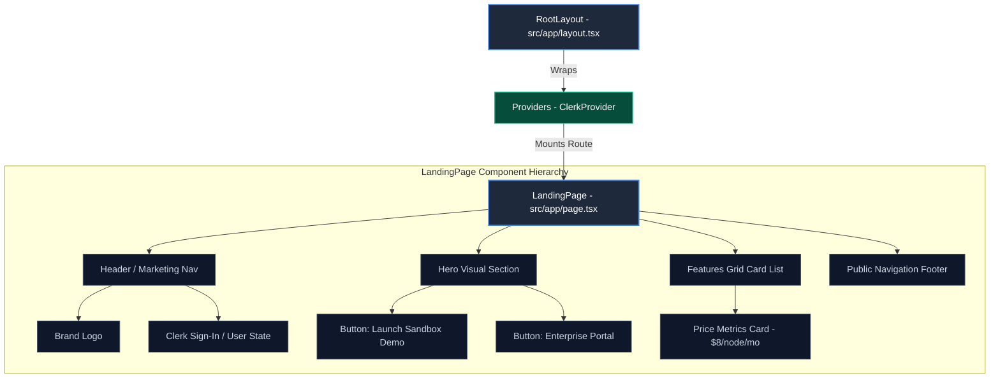
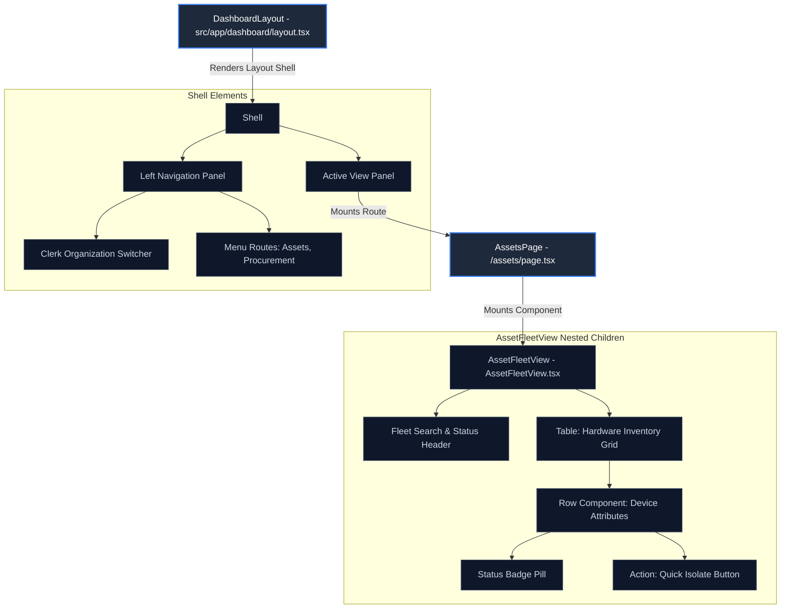
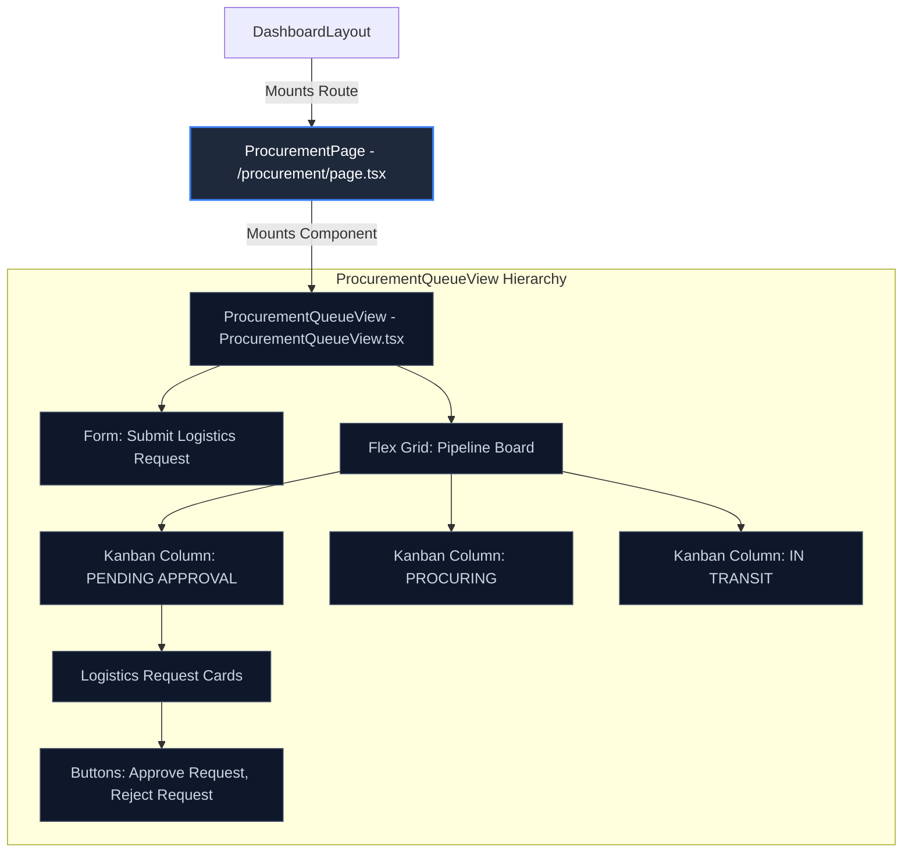

# LifecycleZero: Frontend Component Hierarchies & Trees

This document maps out the React component hierarchies, mounted node structures, and state relationships for the LifecycleZero frontend client.

---

## 🗺️ 1. Multi-Page Component Trees

### 🏠 Tree A: Root Landing & Marketing Page (`/`)
*   **Path**: `src/app/page.tsx`
*   **Role**: Public B2B acquisition portal and initial route selector.



---

### 🔬 Tree B: Live Security Incident Cockpit (`/security`)
*   **Path**: `src/app/security/page.tsx` -> `src/components/Dashboard.tsx`
*   **Role**: Real-time SOC (Security Operations Center) dashboard and threat isolation command.

```mermaid
graph TD
    classDef page fill:#1e293b,stroke:#3b82f6,stroke-width:2px,color:#fff
    classDef component fill:#0f172a,stroke:#475569,stroke-width:1px,color:#cbd5e1
    classDef modal fill:#450a0a,stroke:#ef4444,stroke-dasharray: 5 5,color:#fff

    SecurityPage[SecurityPage - src/app/security/page.tsx] -->|Mounts Client Component| Dashboard[Dashboard - src/components/Dashboard.tsx]
    
    subgraph Dashboard Inner Layout Tree
        Dashboard --> Navbar[Header Navigation]
        Navbar --> TenantSelector[Dropdown: Active Tenant ID]
        Navbar --> MuteButton[Toggle: Audio Mute]
        Navbar --> UserStatus[User Button / ADM Bypass Badge]

        Dashboard --> Marquee[Marquee Live Telemetry Stats Ticker]

        Dashboard --> GridContainer[Grid Dashboard Container]
        
        %% Metrics Row
        GridContainer --> MetricCard1[MetricCard: ASSETS_TRACKED]
        GridContainer --> MetricCard2[MetricCard: ROGUE_MODELS]
        GridContainer --> MetricCard3[MetricCard: ISOLATED_HOSTS]
        GridContainer --> MetricCard4[MetricCard: ACTIVE_THREATS]

        %% Sidebar Column
        GridContainer --> SidebarColumn[Left Sidebar Column]
        SidebarColumn --> NavigationControls[Dashboard Route Navigation Buttons]
        SidebarColumn --> BillingCard[B2B Billing & Quota Progress Card]
        BillingCard --> UpgradeBtn[Button: Upgrade to Enterprise]

        %% Mid Column
        GridContainer --> MidColumn[Middle Content Column]
        MidColumn --> IncidentFeed[Incident Feed Alerts List]
        IncidentFeed --> IncidentCards[Incident Card Nodes]
        IncidentCards --> IsolateBtn[Button: Isolate Host]

        %% Right Column
        GridContainer --> RightColumn[Right Content Column]
        RightColumn --> Canvas3DGrid[Tactical3DGrid - HTML5 Canvas 3D SOC Grid]
        RightColumn --> OllamaConfigCard[Ollama Threat AI Config Form]
        RightColumn --> SandboxCard[Threat Simulation Sandbox panel]
        SandboxCard --> RunSimBtn[Button: Run Threat Simulation]
        SandboxCard --> ConsoleLog[Terminal Simulator Logs Screen]
    end

    subgraph Overlay Modals
        Dashboard -.->|showPaymentModal = true| StripeModal[Stripe Payment Checkout Modal]
        Dashboard -.->|confirmIsolate = Asset| IsolateConfirmModal[Isolation Confirmation Modal]
    end

    class SecurityPage,Dashboard page
    class Navbar,TenantSelector,MuteButton,UserStatus,Marquee,GridContainer,MetricCard1,MetricCard2,MetricCard3,MetricCard4,SidebarColumn,NavigationControls,BillingCard,UpgradeBtn,MidColumn,IncidentFeed,IncidentCards,IsolateBtn,RightColumn,Canvas3DGrid,OllamaConfigCard,SandboxCard,RunSimBtn,ConsoleLog component
    class StripeModal,IsolateConfirmModal modal
```



---

### 🏢 Tree C: Dashboard Layout & Fleet Assets View (`/dashboard/assets`)
*   **Path**: `src/app/dashboard/layout.tsx` -> `/assets/page.tsx`
*   **Role**: Administrative B2B layout wrapping assets grids.



---

### 📈 Tree D: Asset Historical Detail & Log Timeline (`/dashboard/assets/[id]`)
*   **Path**: `src/app/dashboard/assets/[id]/page.tsx`
*   **Role**: Displays chronological CPU/RAM charts and SOC audit trail for a single workstation.

```mermaid
graph TD
    classDef page fill:#1e293b,stroke:#3b82f6,stroke-width:2px,color:#fff
    classDef component fill:#0f172a,stroke:#475569,stroke-width:1px,color:#cbd5e1

    DashboardLayout[DashboardLayout] -->|Mounts Route| AssetDetailPage[AssetDetailPage - [id]/page.tsx]
    
    subgraph AssetDetailPage Hierarchy
        AssetDetailPage --> DetailHeader[Header: Device Name, Serial, UUID]
        
        %% Recharts Node
        AssetDetailPage --> ChartContainer[Recharts Area Chart Container]
        ChartContainer --> ResponsiveContainer[ResponsiveContainer]
        ResponsiveContainer --> AreaChart[AreaChart: RAM & CPU Telemetry History]
        AreaChart --> Tooltip[Tooltip]
        AreaChart --> AreaNodes[Area Series Nodes]
        
        %% Audit Trail
        AssetDetailPage --> AuditLogsSection[Audit Trail Chronological Log]
        AuditLogsSection --> TimelineNodes[Timeline Log Card Nodes]
        TimelineNodes --> BadgeActor[Badge Actor: System / User Admin]
    end

    class AssetDetailPage page
    class DetailHeader,ChartContainer,ResponsiveContainer,AreaChart,Tooltip,AreaNodes,AuditLogsSection,TimelineNodes,BadgeActor component
```

---

### 📦 Tree E: Procurement Logistics Pipeline Board (`/dashboard/procurement`)
*   **Path**: `src/app/dashboard/procurement/page.tsx` -> `ProcurementQueueView.tsx`
*   **Role**: Handles submission and approvals tracking for B2B fleet logistics.


